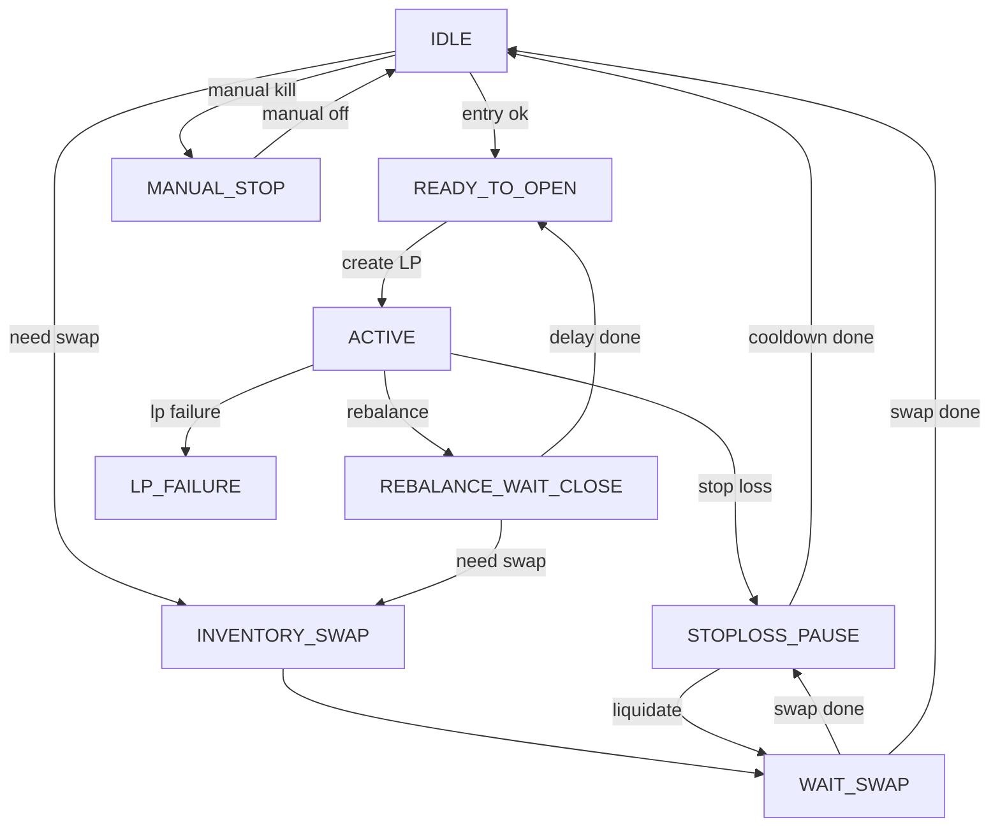

# CLMM LP 控制器设计说明

本文参考 `hummingbot/docs/design/lp_controller_executor_design.md` 的设计范式，详细说明本仓库的 CLMM LP 控制器
（`clmm_lp`）实现：职责边界、状态机、资金/数量链路、核心决策逻辑、失败处理与未来演进。

## 1. 范围与参考

- Controller 入口：`bots/controllers/generic/clmm_lp.py`
- Controller 内部组件（types/adapters/cost filter）：`bots/controllers/generic/clmm_lp_components.py`
- Controller 配置：`bots/conf/controllers/clmm_lp.yml`
- Loader 脚本：`bots/scripts/v2_with_controllers.py`
- LP Executor：`hummingbot/hummingbot/strategy_v2/executors/lp_position_executor/`
- Swap Executor：`hummingbot/hummingbot/strategy_v2/executors/gateway_swap_executor/`
- 预算模块：`hummingbot/hummingbot/strategy_v2/budget/`

本文描述当前实现（包含库存管理）与官方设计的一致性与扩展点。

## 2. 设计原则（与官方文档一致）

- **职责分离**：Controller 只做决策、Executor 只做执行。
- **显式状态机**：控制器维护单一状态机，Executor 自有状态机。
- **单一时间源**：使用 `market_data_provider.time()` 作为时钟。
- **安全优先**：预算保护、链上动作串行化、错误可恢复。
- **可组合**：控制器输出 `ExecutorAction`，不直接操作连接器。

## 3. 架构概览

```
Controller (clmm_lp)
  ├─ TokenOrderMapper / PriceMapper（`trading_pair` ↔ `pool_trading_pair`）
  ├─ Portfolio & Budget（wallet/anchor/budget reserve/fee EWMA）
  ├─ Flow Engine（StopLoss / Rebalance / Entry）→ ExecutorActions
  ├─ LPPositionExecutor (开/关仓、状态上报)
  ├─ GatewaySwapExecutor (库存纠偏/止损清仓)
  └─ BudgetCoordinator (钱包余额锁)
```

### 3.1 Controller 角色
- 读取市场价格、executor 状态与预算快照。
- 决定：何时开仓、何时平仓、何时补仓/换仓、何时止损。
- 只输出 `CreateExecutorAction` / `StopExecutorAction`。

### 3.2 LPPositionExecutor 角色
- 维护 LP 头寸生命周期状态机（OPENING/IN_RANGE/OUT_OF_RANGE/CLOSING/...）。
- 通过 `custom_info` 上报状态和数量：`state`、`current_price`、`lower_price`、`upper_price`、
  `base_amount`、`quote_amount`、`base_fee`、`quote_fee`、`out_of_range_since`。
  - 注意：当 `pool_trading_pair` 与 `trading_pair` 方向相反时，Executor 上报的 base/quote 语义以 `pool_trading_pair` 为准；
    Controller 读取后会映射回 `trading_pair` 语义，再用于预算/止损/再平衡等计算。

### 3.3 GatewaySwapExecutor 角色
- 执行 swap（用于开仓/再平衡的库存纠偏，以及止损清仓）。
- 通过 `custom_info` 回传实际 `amount_in/amount_out`，用于观察与余额刷新。

## 4. 配置规范（必须遵守）

- `controller_name` 必须与模块文件名一致：`clmm_lp`。
- `controller_type` 必须对应目录：`generic`。
- `id` 为 Controller 实例唯一标识，**推荐与配置文件名一致**。

推荐示例：
- 配置文件名：`clmm_lp.yml`
- `id: clmm_lp`
- `controller_name: clmm_lp`

### 4.1 `trading_pair` vs `pool_trading_pair`

在部分链上 CLMM 场景里，**router 的报价/下单 pair 顺序**与 **pool/LP 的 token 顺序**可能相反：

- `trading_pair`：作为控制器的**参考计价 pair**（预算、价格、wallet_base/quote 语义、router 报价与 swap 下单均以此为准）。
  - `position_value_quote` 以 `trading_pair` 的 quote 计价。
- `pool_trading_pair`（可选）：作为 **pool 的 token0-token1 顺序（按地址排序）**。
  - 必须等于 `trading_pair` 或其反转（`BASE-QUOTE` ↔ `QUOTE-BASE`）。
  - 用于 LPPositionExecutor 的 `trading_pair/base_token/quote_token`，以及开仓时的金额与价格区间映射（base/quote 金额 swap + 价格区间倒数映射）。

示例（router 按 `TOKEN-USDT` 计价，但 pool token 顺序为 `USDT-TOKEN`）：
```yaml
trading_pair: TOKEN-USDT
pool_trading_pair: USDT-TOKEN
```

## 5. Controller 状态机（显式）

> 控制器状态机是高层决策状态，不等同于 LP Executor 的内部状态。
> 实现说明：`ControllerState` 为 view-only（由 `Snapshot(事实) + Context(内部状态) + Intent/Decision` 派生），不作为逻辑分支的控制变量。

### 5.1 状态列表
- **IDLE**：无 LP 仓位，无待执行动作。
- **ACTIVE**：LP Executor 运行中。
- **REBALANCE_WAIT_CLOSE**：已发出 stop 等待重开（包含 reopen delay）。
- **INVENTORY_SWAP**：库存纠偏 swap 已提交，等待执行。
- **READY_TO_OPEN**：准备开仓（预算/校验完成）。
- **WAIT_SWAP**：swap 在运行（库存纠偏/止损清仓），暂停其他动作。
- **STOPLOSS_PAUSE**：止损触发后的冷却期。
- **MANUAL_STOP**：人工止损（manual_kill_switch）。
- **LP_FAILURE**：LP executor 失败（RETRIES_EXCEEDED / FAILED），需人工介入。

### 5.2 状态表（入口/出口）

| 状态 | 含义 | 进入条件 | 退出条件 |
| --- | --- | --- | --- |
| IDLE | 无头寸/无动作 | entry 条件不满足或预算不足 | entry 条件满足且需库存纠偏 → INVENTORY_SWAP；无需纠偏 → READY_TO_OPEN |
| ACTIVE | LP 运行中 | LP executor active | 触发止损 → STOPLOSS_PAUSE；触发再平衡 → REBALANCE_WAIT_CLOSE |
| REBALANCE_WAIT_CLOSE | 等待重开 | stop LP 成功且在 reopen delay | reopen delay 到期且需库存纠偏 → INVENTORY_SWAP；无需纠偏 → READY_TO_OPEN |
| INVENTORY_SWAP | 库存纠偏 swap 已提交 | entry/rebalance 触发纠偏 | swap executor active → WAIT_SWAP；失败 → IDLE |
| WAIT_SWAP | swap 执行中 | 库存纠偏/止损清仓 swap active | swap 完成 → STOPLOSS_PAUSE（止损）或 IDLE（纠偏） |
| READY_TO_OPEN | 准备开仓 | 预算/价格校验通过 | 创建 LP → ACTIVE；失败 → IDLE |
| STOPLOSS_PAUSE | 止损冷却 | stop loss 触发或清仓等待 | 冷却结束且无 pending liquidation → IDLE |
| MANUAL_STOP | 人工停止 | manual_kill_switch=true | manual_kill_switch=false → 回到 IDLE |
| LP_FAILURE | LP 执行失败锁 | LP executor RETRIES_EXCEEDED/FAILED | 仅人工干预（当前无自动解锁） |

### 5.3 状态迁移逻辑（要点）
- MANUAL_STOP 优先级最高，直接 stop LP executor。
- 库存纠偏/止损清仓 swap 运行时，控制器进入 WAIT_SWAP，避免并发动作。
- LP executor 进入 RETRIES_EXCEEDED 或 failed 时进入 LP_FAILURE，阻止自动重新入场。
- LP executor 运行时：
  - 优先评估 stop loss；
  - 再评估 rebalance。
- stop loss 或 rebalance 触发后，先 stop LP，再进入重开或清仓流程。
- stop loss 冷却期内禁止重新开仓。
- stop loss 清仓失败时进入重试（基于 cooldown）直到清仓成功或无 base 余额。

### 5.4 Tick 决策顺序（精简伪代码）

```
if manual_kill_switch:
  stop LP; state=MANUAL_STOP; return

if lp_failure_detected:
  state=LP_FAILURE; return

if swap_executor active:
  state=WAIT_SWAP; return

if LP executor(s) active:
  if stop_loss_triggered:
    stop LP; state=STOPLOSS_PAUSE; return
  if rebalance_triggered:
    stop LP; state=REBALANCE_WAIT_CLOSE; return
  state=ACTIVE; return

if pending_liquidation:
  create swap; state=WAIT_SWAP; return

if now < stop_loss_until_ts:
  state=STOPLOSS_PAUSE; return

if pending_rebalance:
  if now < reopen_after_ts: state=REBALANCE_WAIT_CLOSE; return
  if inventory_swap_needed:
    create swap; state=INVENTORY_SWAP; return
  open LP; state=ACTIVE; return

if not entry_triggered:
  state=IDLE; return

if inventory_swap_needed:
  create swap; state=INVENTORY_SWAP; return

resolve entry amounts (基于 position_value_quote 目标比例)
if not available: state=IDLE; return
open LP; state=ACTIVE
```

### 5.5 状态机流程图（Mermaid）



### 5.4 状态机审阅（简化结论）

- **优先级明确**：`manual_kill_switch` > `lp_failure` > `swap_executor` > `stop_loss` > `rebalance` > `pending_liquidation` > `entry`。
- **互斥保障**：`WAIT_SWAP` 期间不触发 LP 开仓/重开，避免并发链上动作。
- **再平衡闭环**：out-of-range → stop LP → pending_rebalance → open LP。
- **避免卡死**：cost filter 拒绝时，长时间 out-of-range 会触发强制重平衡。
- **风险隔离**：stop loss 与 manual stop 不受 cost filter 影响。

## 6. 数量/资金链路（预算链路）

### 6.1 预算模式
- **WALLET**：直接使用钱包余额；BudgetCoordinator 负责锁定。
- **固定名义预算**：`position_value_quote` 为目标名义规模，钱包总市值不足时不换仓/不入场。

### 6.2 开仓数量计算
- 使用 `position_value_quote` 与 `target_base_value_pct`，按当前价格计算 `base_amount/quote_amount`。
- 钱包总市值不足 `position_value_quote` 时不入场。
- 若库存偏离目标且 `auto_swap_enabled=true` 且 `delta_quote_value >= position_value_quote * swap_min_value_pct`，先做库存纠偏 swap。
- 若无需纠偏或 `auto_swap_enabled=false`，按目标比例开仓；不足的一侧按钱包实际量。

> 建议使用独立钱包，避免其他资产被库存调仓影响。

### 6.3 预算锁与结算
- 开仓前：
  - BudgetCoordinator 负责 `reserve()` 校验钱包可用余额与 gas 预留。
- 平仓后不做内部预算结算，策略以钱包实仓为准。

### 6.4 交换（swap）预算
- 库存纠偏 swap 仅在开仓与再平衡流程触发，使用 `router_connector`。
- 控制器通过 `WAIT_SWAP` 状态串行化库存纠偏与止损清仓，避免并发链上动作。
- 纠偏 swap 的输入数量按目标差额计算，并应用 `swap_safety_buffer_pct` 与 `swap_min_value_pct` 下限。
- 清仓 swap 额度使用预算切片中的 base，并应用 `swap_safety_buffer_pct`。

### 6.5 止损基准（预算切片）
- 止损使用“预算切片的市值变化”，基准为 LP 开仓时刻的预算等值（`anchor_budget`），切片上限为 `position_value_quote`。
- 预算切片 = LP 已部署价值 + 钱包中分配给预算的切片（按开仓时钱包比例分配）。
- 当前预算权益 = `deployed_value + wallet_slice_value`（统一以 quote 计价）。
- stop loss 触发条件：`budget_equity <= anchor_budget * (1 - stop_loss_pnl_pct)`。

## 7. 再平衡逻辑

触发条件全部满足：
- LP executor 状态为 `OUT_OF_RANGE`；
- 偏离范围超过 `hysteresis_pct`；
- out_of_range 时长超过 `rebalance_seconds`；
- 满足冷却时间 `cooldown_seconds`；
- 小时内重平衡次数未超过 `max_rebalances_per_hour`。
- 若开启 cost filter，需通过成本过滤判定。

触发后流程：
1) Stop LP executor。
2) 等待 `reopen_delay_sec`。
3) 若库存偏离目标且允许纠偏，执行 swap 并等待余额刷新。
4) 余额满足目标比例时开新 LP（按目标比例开仓）。

### 7.1 策略A：再平衡成本过滤（Cost Filter）

**目标**：避免趋势行情中频繁“全平重开”导致的手续费与滑点吞噬收益。

**实现位置**：`evaluate_cost_filter()` 与内部常量在 `bots/controllers/generic/clmm_lp_components.py`；Controller 在 `bots/controllers/generic/clmm_lp.py` 调用。

**核心输入**（均在 Controller 内部观测，不依赖外部 volume）：
- **fee_rate**：使用 LP position 的 pending fee 变化估计（`base_fee/quote_fee` 转 quote）。
- **in_range_time**：固定评估窗口（常量 1 小时）。
- **cost**：固定成本 + 预计 swap 成本（滑点 + 固定费率缓冲）。

**估算方法（简化版）**：
1) **fee_rate**（quote/sec）
   - 仅在 `IN_RANGE` 时更新。
   - EWMA：`fee_rate = fee_rate*(1-α) + (delta_fee/dt)*α`（α=0.1，取样间隔 10 秒，内部常量）。
   - 若 EWMA 不可用：使用 `cost_filter_fee_rate_bootstrap_quote_per_hour / 3600`，为 0 时表示 fee_rate=0。
2) **期望在场时间**：
   - `in_range_time = 3600` 秒（内部常量，不依赖波动率）。
3) **成本**：
   - `fixed_cost = cost_filter_fixed_cost_quote`
   - `swap_cost`：当 `auto_swap_enabled=true` 时按固定比例估算，否则为 0
   - `C = fixed_cost + swap_cost`
4) **决策**：
   - `expected_fee = fee_rate * in_range_time`
   - `expected_fee >= C * 2`（内部常量）
   - `payback = C / max(fee_rate, 1e-9) <= cost_filter_max_payback_sec`

#### 7.1.1 决策流程（确定性步骤）

给定当前价格、position custom_info 和配置项，控制器按如下顺序判断（顺序固定）：
1) 若 `cost_filter_enabled=false` → **允许**
2) 若 `current_price<=0` → **拒绝**（invalid_price）
3) 计算 `fee_rate`：
   - 优先用 EWMA；
   - EWMA 不可用时，使用 `cost_filter_fee_rate_bootstrap_quote_per_hour / 3600`
4) 固定 `in_range_time=3600s`
5) 计算 `expected_fees = fee_rate * in_range_time`
6) 计算成本 `C = fixed_cost + swap_cost`
7) 若 `C<=0` → **允许**（zero_cost）
8) 若 `expected_fees < C * 2` → **拒绝**（fee_rate_zero / expected_fee_below_threshold）
9) 计算 `payback = C / max(fee_rate, 1e-9)`
10) 若 `payback > cost_filter_max_payback_sec` → **拒绝**（payback_exceeded）
11) 若 out-of-range 持续超过 `max(rebalance_seconds * 10, 600)` → **允许**（force_rebalance）
12) 否则 → **允许**（approved）

**边界处理（确定性规则）**：
- **fee_rate 缺失**：使用 `cost_filter_fee_rate_bootstrap_quote_per_hour / 3600`，为 0 时 fee_rate=0。
- **fee_rate=0**：expected_fees=0，触发 `fee_rate_zero` 拒绝，除非成本为 0。
- **价格无效**：直接拒绝 rebalance。
- **成本为 0**：直接放行（不进行收益判断）。
- **回本时间**：使用 `max(fee_rate, 1e-9)` 防止除零。
- **强制重平衡**：长时间 out-of-range 会绕过 cost filter，避免“卡死”。

#### 7.1.2 与其他逻辑的交互与优先级

- **Stop loss 优先**：止损触发会先停止 LP，不受 cost filter 影响。
- **冷却与频率限制优先**：`rebalance_seconds` / `cooldown_seconds` / `max_rebalances_per_hour` 先过滤，再进入 cost filter。

**日志**：
- 控制器在触发 cost filter 判定时输出一条聚合日志（按 `max(cooldown_seconds, 60)` 节流）。
- 输出包含：fee_rate 来源、in_range_time、widths、expected_fees、cost、payback、decision。

#### 7.1.3 生产可用性说明（模型假设明确）

- 该过滤器是 **确定性决策器**：相同输入必然给出相同结论。
- 估算仅依赖固定时间窗与历史 fee_rate，**不需要波动率建模**，避免参数陷阱。
- 为控制风险，建议设置合理 `max_payback_sec`，安全系数固定为 2。
- 强制重平衡用于避免长期 out-of-range 锁死。

#### 7.1.4 验证与测试建议（可重复）

- **冷启动**：`fee_rate_bootstrap=0` 时，确认 cost filter 在 out-of-range 阶段拒绝；超过强制阈值后允许。
- **高成本**：把 `cost_filter_fixed_cost_quote` 设置为高值，确认 `expected_fee_below_threshold` 触发。
- **回本门槛**：调高 `cost_filter_max_payback_sec`，观察同一成本下从拒绝变为允许。
- **日志完整性**：检查 cost filter 日志字段齐全且节流生效。


## 8. 入场逻辑

- `target_price <= 0` 时不限制价格。
- `trigger_above == true`：价格 >= target_price 才入场。
- `trigger_above == false`：价格 <= target_price 才入场。
- stop loss 后 `reenter_enabled` 为 false 时禁止再入场。

## 9. 止损逻辑

- 止损基于**预算切片市值回撤**：
  - `budget_equity = deployed_value + wallet_slice_value`（统一以 quote 计价）
  - `anchor_budget` 在 LP 激活时初始化：预算值 = 已部署价值 + 钱包中分配给预算的切片（重启后重新初始化）
- 当 `budget_equity <= anchor_budget * (1 - stop_loss_pnl_pct)` 触发止损。
- 触发后进入 `STOPLOSS_PAUSE`，持续 `stop_loss_pause_sec`。
- 若 `stop_loss_liquidation_mode == quote`：
  - 触发清仓 swap（base -> quote）。

> 注意：止损只评估预算切片，其他钱包资金不会稀释/放大止损。

## 10. 连接器/网关链路

- LP 执行通过 `connector_name`（如 `uniswap/clmm`）。
- Swap 通过 `router_connector`（如 `pancakeswap/router`）。
- Controller 的 `update_markets` 必须注册两者。

## 11. 关键配置项说明（精选）

- `position_value_quote`：单次 LP 目标名义金额（quote 计价）。
- `position_width_pct`：价格区间宽度百分比。
- `hysteresis_pct`：出界后再平衡的偏离阈值。
- `rebalance_seconds` / `cooldown_seconds`：出界持续时长 / 冷却时间。
- `reopen_delay_sec`：stop 后延时重开。
- `target_base_value_pct`：目标比例（0-1，0=纯 quote，1=纯 base）。
- `auto_swap_enabled`：是否启用库存纠偏 swap。
- `swap_min_value_pct`：库存纠偏最小名义值占比（相对 `position_value_quote`，默认 5%）。
- `swap_safety_buffer_pct`：swap 输入安全缓冲。
- `cost_filter_enabled`：是否启用再平衡成本过滤。
- `cost_filter_fee_rate_bootstrap_quote_per_hour`：fee_rate 冷启动默认值。
- `cost_filter_fixed_cost_quote`：固定链路成本估计。
- `cost_filter_max_payback_sec`：最大可接受回本时间。
- `stop_loss_pnl_pct` / `stop_loss_pause_sec`：止损阈值与冷却时间。
- `stop_loss_liquidation_mode`：止损后是否换成 quote。
- `budget_key`：预算隔离键（默认 `id`）。
- `native_token_symbol` / `min_native_balance`：gas 预留。

### 11.1 运行时内部状态（对外可观测）

Controller 将关键内部状态输出到 `processed_data`，便于观察与诊断：
- `controller_state` / `lp_state`：控制器与 LP executor 状态。
- `stop_loss_anchor`：预算止损锚定值（quote 计价）。
- `pending_liquidation`：是否等待止损清仓。
- `rebalance_pending` / `rebalance_plans`：再平衡计划数量与明细（按 `executor_id` 跟踪 stage/reopen_after_ts/open_executor_id）。
- `inventory_swap_failed`：最近一次库存纠偏 swap 是否失败。
- `lp_failure_blocked`：LP executor 是否已进入失败锁。

**Cost Filter 内部常量（不可调）**：
- 定义位置：`bots/controllers/generic/clmm_lp_components.py`。
- 评估窗口固定为 1 小时。
- swap_cost 仅在 `auto_swap_enabled=true` 时参与估算。
- fee_rate_floor 固定为 1e-9，安全系数固定为 2。
- 强制重平衡阈值：`max(rebalance_seconds * 10, 600)`。

## 12. 风险控制与异常处理

- 止损清仓 swap 失败：
  - 保持 STOPLOSS_PAUSE，等待冷却后重试清仓。
- 避免并发链上动作：
  - swap executor 运行时禁止 LP 开仓；
  - BudgetCoordinator 内部 `action_lock` 可用于串行化（Executor 自身使用）。

## 13. 不变式（Invariant）

- Controller 不假设只有一个 LP executor；允许多个 active，并按 `executor_id` 维护独立上下文。
- swap executor 运行时 Controller 不触发其他执行动作。
- 开仓必须通过预算 reservation。

## 14. 已知限制

- stop loss 仅统计 base/quote 资产，未包含 gas 等其他代币。
- 无多层（core/edge）与多池组合编排。

## 15. 未来计划

- 引入 core/edge 多层 LP 控制器并共享预算。
- 引入更细粒度的 swap 重试和失败恢复策略。
- 增加 Controller 状态机与预算的单元测试。
- Dashboard 增强：展示 Controller 状态与预算快照。
